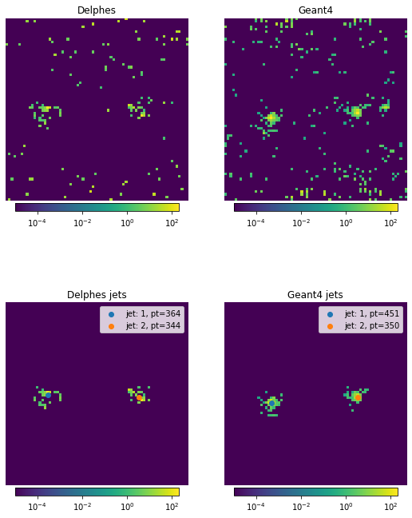

# CALPAGAN: CALorimetry for PArticles using Generative Adversarial Networks

This repository contains one of the experiments carried out for the work "CALPAGAN" (presented in the conference [YEFIST](http://www.yefist.org/), on  September 25, 2022).

As a model, we use Pix2pix, a conditional generative adversarial networks (cGAN), proposed in the article [Image-to-Image Translation with Conditional Adversarial Networks](https://arxiv.org/abs/1611.07004).

---

## Requirements

This repository is prepared to train the model entirely on Google Colab. That means, to train the model and generate the images without any issue, it is sufficient to

- open the notebook `calpagan_train.ipynb` on Google Colab (using the [link](https://colab.research.google.com/github/byrkbrk/calpagan-experiment/blob/main/calpagan_train.ipynb) or the link *Open in Colab* inside the notebook)
- log in your Google account (if you haven't yet)
- run the (self-explanatory) notebook cells one by one

## Training dataset

Our training dataset consists of 5000 Delphes and Geant4 (simulation) images (which represent condition and real images, respectively). One examplar pair from the dataset and the corresponding jet reconstructions are presented below:

